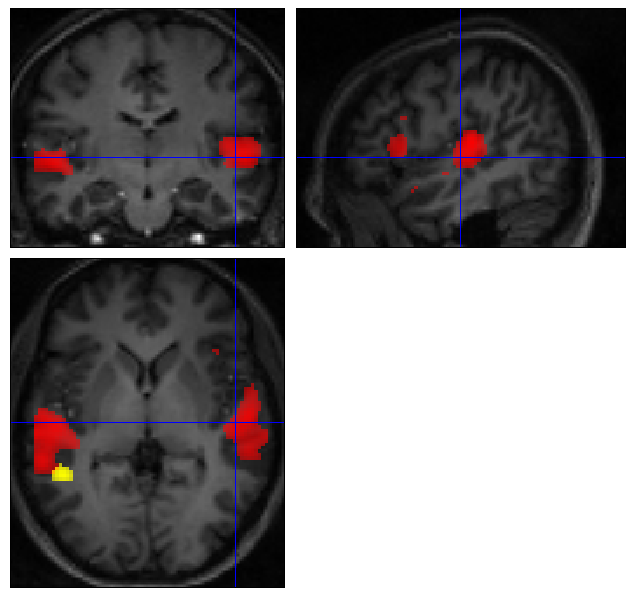
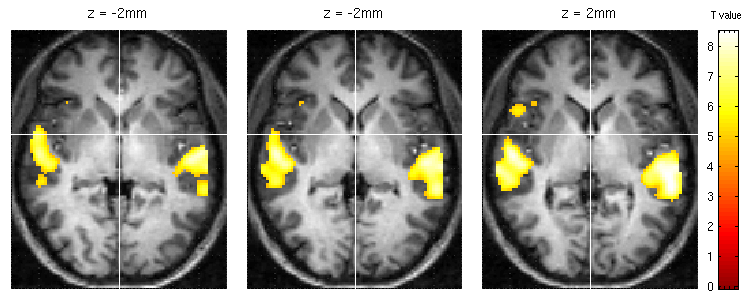
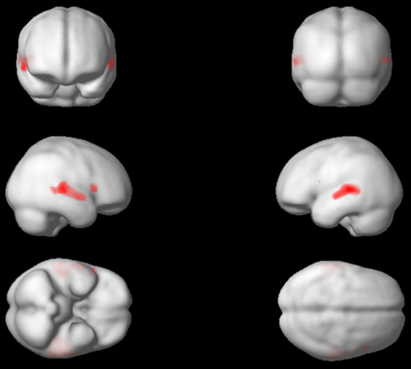

.. _spmviz:

SPM
---

- URL: http://www.fil.ion.ucl.ac.uk/spm/
- License: GPL
- Cost: Free (except for the Matlab bit)
- 2D: Yes
- 3D: Projections onto preprocessed surface bitmaps
- OS: All
- Language: Matlab, C
- Visualization Toolkit: matlab
- GUI Toolkit: Matlab's layer over Java

Features done well
~~~~~~~~~~~~~~~~~~

The yoked multi-image orthogonal viewer is very important.  It has the
ability to deal with images of different voxel resolutions and
real-space orientations.

.. _spm-ortho-slice:

Scriptable orthogonal slice viewer
~~~~~~~~~~~~~~~~~~~~~~~~~~~~~~~~~~

It's not often scripted.  Nice set of tools to review the current affine
transform, and supplement it with further transforms:

.. image:: ../images/spm_display.png

.. _spm-checkreg:

Yoked orthogonal views
~~~~~~~~~~~~~~~~~~~~~~

SPM has the killer feature of being able to display yoked orthogonal
slice views that take into account the image affine transforms.  It uses
the SPM graphics window, and can only usefully display about 6 images
without the images becoming too small, and the display becoming too
slow:

.. image:: ../images/checkreg.png

.. _spm-orth-overlays:

SPM image overlays
~~~~~~~~~~~~~~~~~~

You can overlay activation images onto anatomical images with the SPM
orthogonal slice viewer, with the ``Add blobs`` interface:

By a tiny bit of scripting, you can add continuous true color overlays::

   spm_orthviews('addtruecolourimage')

.. image:: ../images/add_truecolor.jpg

SPM Lightbox-like
~~~~~~~~~~~~~~~~~

There is simple slice by slice viewing plumbed into the main results section:

SPM 3D rendering
~~~~~~~~~~~~~~~~

and more sophisticated lightbox viewing via a partially integrated tool:
http://imaging.mrc-cbu.cam.ac.uk/imaging/DisplaySlices

3D Rendering is in 2D, sort of.  In order to render, you need first to
extract the brain surface, and then create 2D bitmaps of the rendered
surface from canonical views.  The rendering then uses these bitmaps and
information about where each pixel is in relationship to the surface, to
create the rendering:

