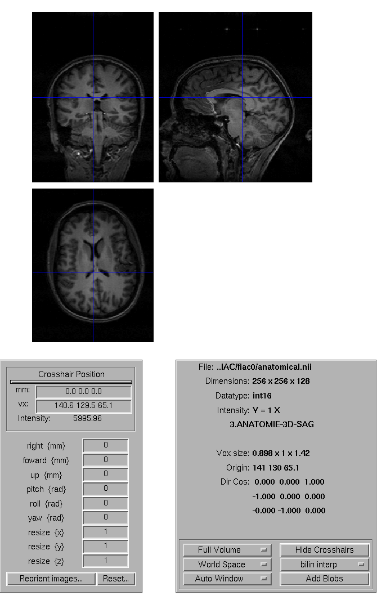

.. _spmviz:

SPM
---

- URL: http://www.fil.ion.ucl.ac.uk/spm/
- License: GPL
- Cost: Free (except for the Matlab bit)
- 2D: Yes
- 3D: Projections onto preprocessed surface bitmaps
- OS: All
- Language: Matlab, C
- Visualization Toolkit: matlab
- GUI Toolkit: Matlab's layer over Java

There is a scriptable orthogonal slice viewer.  It's not often scripted.
Nice set of tools to review the current affine transform, and supplement
it with further transforms:

SPM has the killer feature of being able to display yoked orthogonal
slice views that take into account the image affine transforms.  It uses
the SPM graphics window, and can only usefully display about 6 images
without the images becoming too small, and the display becoming too
slow:

.. image:: images/checkreg.png

You can overlay activation images onto anatomical images with the SPM
viewer, with the ``Add blobs`` interface:

